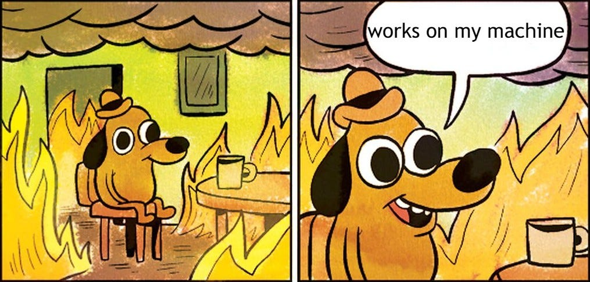
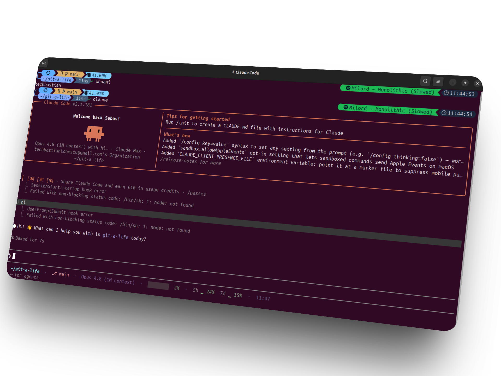

<h1 align="center">GIT-A-LIFE</h1>

<p align="center">
  
</p>

<p align="center">
  
  
  
  
</p>

My whole machine, in a box. New laptop? Clone this, run one script, go make coffee,
come back to the setup I already know like nothing happened: shell, prompt, config,
apps. Windows (Git Bash) and Linux (Ubuntu/Debian). I've rebuilt the same laptop one
too many times, so now it's a script's problem, not mine.

<p align="center">
  
</p>

> **The repo is the truth.** Change stuff *here*, run the script. Edit the live
> files directly and they get clobbered next run. Then you get to be sad about it.

<hr>

## Run it

```bash
git clone https://github.com/techbastianionescu/git-a-life.git ~/git-a-life
cd ~/git-a-life
./setup.sh          # everything. go do something else.
```

| Script | What it does | Sudo? |
|:--|:--|:-:|
| `setup.sh` | the whole circus | yes |
| `bootstrap.sh` | config + prompt only (oh-my-posh, jq, font) | no |
| `install-apps.sh` | the apps only | yes |
| `uninstall.sh` | undo it, apps leave only if you say so | yes |

Run any one on its own. All safe to re-run, they skip whatever is already there.
Every line says what happened: `✓ already there`, `↓ installed`, `⚠ your turn`.
That last one means your turn. Read it.

<hr>

## The apps

| App | Windows | Linux |
|:--|:--|:--|
| VS Code · Bruno · DBeaver · Sublime · Thunderbird · Spotify | winget | snap |
| Git + GitHub CLI | winget | apt |
| Claude Code | winget | install script |
| Docker | Desktop | Engine (nobody runs Desktop on Linux on purpose) |

Snaps install in parallel, and Docker plus Claude download in the background while
they go, because watching progress bars finish one at a time is nobody's idea of a
good afternoon. After installing, an interactive step walks the logins and waits at
each: GitHub (a real `gh auth login`, not a fake one), Spotify, Thunderbird, VS Code,
Claude, Docker. Nothing signs in behind your back. No terminal? It skips the lot.

**Want different apps?** One line in [`apps.txt`](apps.txt), the only place that
matters. Install and uninstall both read it, so they can't contradict each other.

```
name | winget id | snap package | classic
```

Fork it, swap the list, it's your life now. The repo's name was a warning.

<hr>

## The whole point

Everything above is plumbing so this one thing looks good: the prompt and the
Claude Code statusline.

<p align="center">
  
</p>

<p align="center"><sub>
  prompt up top (git · battery · now-playing) · statusline below (dir · branch · model · context · 5h / 7d usage · clock)
</sub></p>

Seeing boxes instead of icons? The font installed fine, your terminal just refuses
to use it. GNOME Terminal: Preferences, Profile, Custom font, *JetBrainsMono Nerd
Font*. Then come back and admire it.

<hr>

## Where it all lands

Your home folder. Nothing smuggled into a registry, nothing clever. Every file gets
a dated backup before it's overwritten (`~/.bashrc.bak.20260618-1015`), so you can
always crawl back to your old life.

| What | Where |
|:--|:--|
| Claude Code config | `~/.claude/` |
| Shell startup | `~/.bashrc` (+ `~/.minttyrc` on Windows) |
| Prompt theme | `~/.poshthemes/night-owl.omp.json` |
| Binaries + fonts (Linux) | `~/.local/bin/`, `~/.local/share/fonts/` |
| Prereqs (Windows) | scoop, in `~/scoop/` |
| The apps | wherever apps normally go |

<hr>

## Second thoughts

```bash
cd ~/git-a-life && ./uninstall.sh   # asks before removing apps
```

<hr>

## FAQ

**Is it going to wreck my machine?**
It backs up every file it touches first. Worst case, `./uninstall.sh` and we never speak of this again.

**Something broke.**
Read the output. It told you the exact command to run. `⚠ your turn` is not a vibe, it's an instruction.

**Why "git-a-life"?**
Because it clones a whole life onto a fresh box. Also `dotfiles` is what everyone calls theirs and I wanted mine to sound slightly more unhinged.

**Does it work on macOS?**
No. I don't own a Mac. If you do and you're heartbroken, that's a you-shaped PR.

**It installed Spotify on my work laptop.**
Yes. You're welcome.
